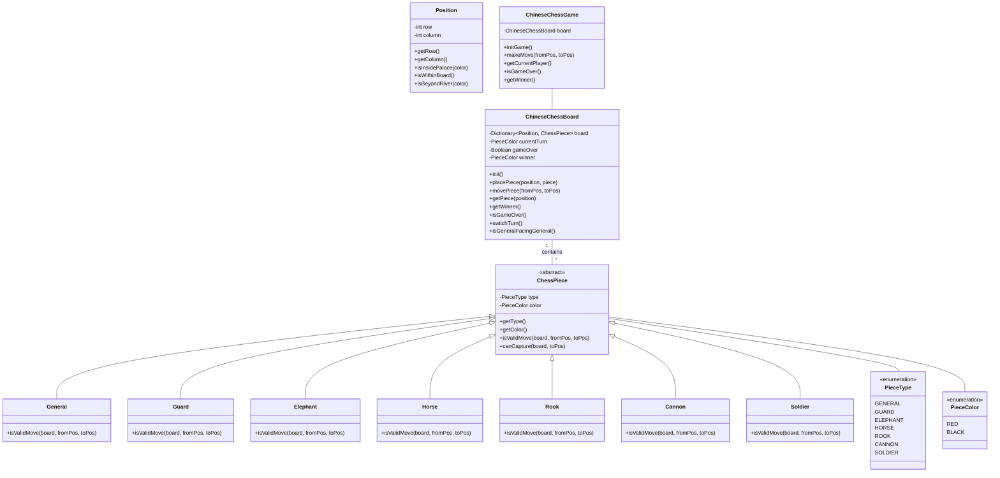

```mermaid
classDiagram
    class ChineseChessBoard {
        -Dictionary~Position, ChessPiece~ board
        -PieceColor currentTurn
        -Boolean gameOver
        -PieceColor winner
        +init()
        +placePiece(position, piece)
        +movePiece(fromPos, toPos)
        +getPiece(position)
        +getWinner()
        +isGameOver()
        +switchTurn()
        +isGeneralFacingGeneral()
    }

    class PieceType {
        <<enumeration>>
        GENERAL
        GUARD
        ELEPHANT
        HORSE
        ROOK
        CANNON
        SOLDIER
    }

    class PieceColor {
        <<enumeration>>
        RED
        BLACK
    }

    class Position {
        -int row
        -int column
        +getRow()
        +getColumn()
        +isInsidePalace(color)
        +isWithinBoard()
        +isBeyondRiver(color)
    }

    class ChessPiece {
        <<abstract>>
        -PieceType type
        -PieceColor color
        +getType()
        +getColor()
        +isValidMove(board, fromPos, toPos)
        +canCapture(board, toPos)
    }

    class General {
        +isValidMove(board, fromPos, toPos)
    }

    class Guard {
        +isValidMove(board, fromPos, toPos)
    }

    class Elephant {
        +isValidMove(board, fromPos, toPos)
    }

    class Horse {
        +isValidMove(board, fromPos, toPos)
    }

    class Rook {
        +isValidMove(board, fromPos, toPos)
    }

    class Cannon {
        +isValidMove(board, fromPos, toPos)
    }

    class Soldier {
        +isValidMove(board, fromPos, toPos)
    }

    class ChineseChessGame {
        -ChineseChessBoard board
        +initGame()
        +makeMove(fromPos, toPos)
        +getCurrentPlayer()
        +isGameOver()
        +getWinner()
    }

    ChineseChessGame -- ChineseChessBoard
    ChineseChessBoard "1" -- "*" ChessPiece: contains
    ChessPiece <|-- General
    ChessPiece <|-- Guard
    ChessPiece <|-- Elephant
    ChessPiece <|-- Horse
    ChessPiece <|-- Rook
    ChessPiece <|-- Cannon
    ChessPiece <|-- Soldier
    ChessPiece -- PieceType
    ChessPiece -- PieceColor
```